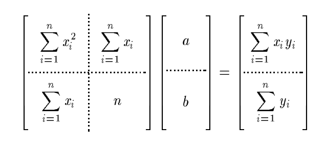
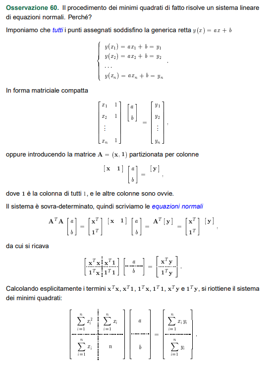

# Regressione lineare tramite il metodo dei minimi quadrati

> **CONSEGNA**: Scrivere un programma che data una tabella di punti x,y costuisce il polinomio di grado m ai mininimi quadrati 

---

## Scomposizione del problema di regressione
1. Regressione LINEARE sfruttando la mtrx già pronta: 

2. Regressione lineare sfruttando il metodo delle equazioni normali

3. Regressione polinomiale mediante un polinomio di grado m, sfruttando il metodo delle equazioni normali

## Gnuplot

1. Estrazione del dataset in un file .txt tramite "fstream".
2. Plot dei punti
3. Plot del polinomio ottenuto

> Lo script per gnuplot deve essere chiamato dal modulo "RegressioneLineare", non dal main
