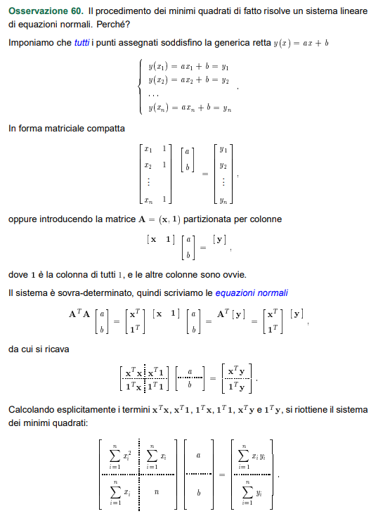

# Regressione lineare tramite il metodo dei minimi quadrati

> CONSEGNA: 
>1. Scrivere un programma che data una tabella di punti x,y costruisce il polinomio di grado m ai mininimi quadrati
>2. Separare logicamente le varie parti del progetto in sottodirectory (raccomandata la creazione di un Makefile)
>    - src, directory contenente il codice sorgente della libreria
>    - include, directory contenente gli header file della libreria
>    - test, directory con i sorgenti dei programmi usati per testare la libreria
>    - doc, directory con la documentazione
>    - lib, directory con la libreria compilata (se serve)
>    - bin, directory con gli eseguibili dei test compilati 

---

## Approccio alla risoluzione

---

### Scomposizione del problema in sottoproblemi più semplici
1. Regressione *lineare* sfruttando la mtrx già pronta: 

<!--
-->

---
---

2. Regressione *lineare* sfruttando il metodo delle equazioni normali

<!--

-->

---
---

3. **Definitivo**: regressione *polinomiale* mediante un polinomio di grado m, sfruttando il metodo delle equazioni normali

---

## Plot dei dati tramite Gnuplot (extra)

1. Estrazione del dataset in un file .txt tramite "fstream".
2. Plot dei punti
3. Plot del polinomio ottenuto

> Path: ./gnuplot/gpscript.sh

